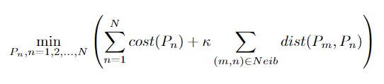
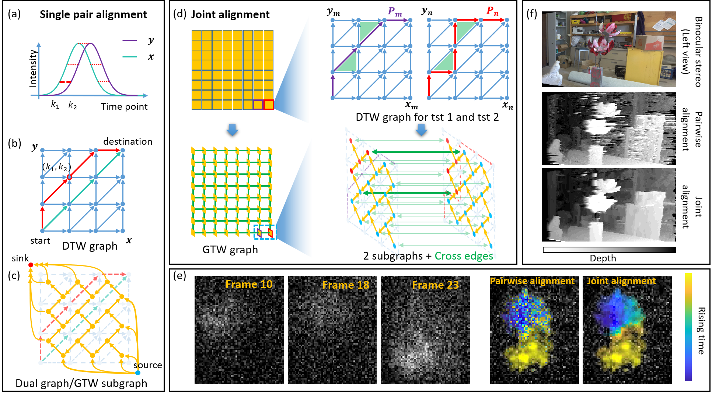
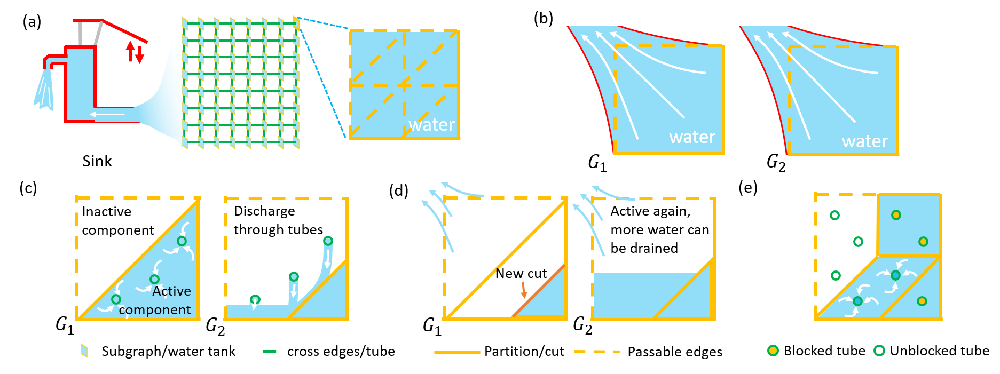
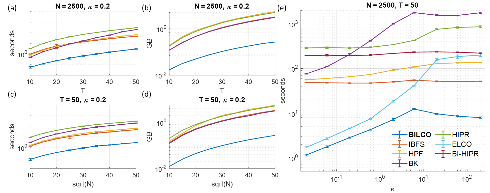
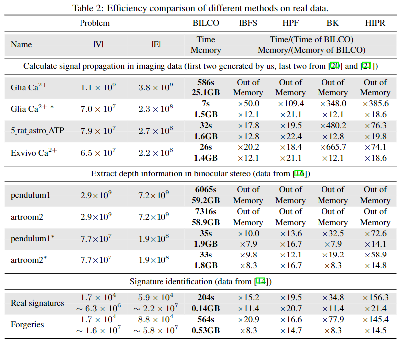

# Welcome to BILCO
BILCO (**BI**directional pushing with **L**inear **C**omponent **O**perations) is an efficient algorithm for solving joint alignment problem and min-cut for GTW (graphical time warping) graph. BILCO has the same theoretical time complexity as the best popular methods such as HIPR (highest-label push-relabel), but it provides a significant empirical efficiency boost without sacrificing the accuracy in the task of joint alignment. On thousands of datasets under various simulated scenarios and three real applications in distinct categories, BILCO could show around 10 to 50 times speed improvement and only cost 1/10 memory compared with the best one among peer methods IBFS (incremental breadth-first search), HPF (Hochbaum's pseudoflow), BK (Boykov-kolmogorov), and HIPR.

If you have any feedback or issue, you are welcome to either post them or send email to yug@vt.edu or mixl18@vt.edu (Guoqiang Yu and Xuelong Mi at Virginia Tech).

## Quick Start
BILCO is implemented in **C++** language with a **MATLAB** wrapper. The repository contains:

* demo.m --------------- A simple version of BILCO. The code is short and easy to understand.
* BILCO.m -------------- The MATLAB wrapper of BILCO.
* BILCOMex.cpp --------- C++ code for BILCO.
* referenced_methods --- Peer methods with MATLAB wrapper.
* experiments_data ----- Real data in three applications mentioned in the paper.

## Joint alignment and GTW
The joint alignment problem can be formulated as

  

where $P_n$ denotes the warping path for the $n_{th}$ time series pair, $N$ is the total number of time series pairs that are jointly aligned, 
$cost(P_n)$ is the alignment cost of the $n_{th}$ time series pair, $dist(P_m, P_n)$ is the warping path distance defined by the area of the region bounded by $P_m$ and $P_n$.
$Neib$ is the set of pair indices $(m,n)$ representing the adjacent time series, and $\kappa$ is the hyperparameter to balance the alignment cost term and the distance term. For example, for 2D grid time-series data, $Neib$ may include the pair of neighboring pixels, and $\kappa$ represents a prior similarity between the pixels.

  

As shown, the equation can be converted to a flow network and solved by finding the min-cut of it. 
The constructed graph, GTW graph, consisting of $N$ GTW subgraphs $\{G^k = (V^k, E^k)|1\leq n \leq N\}$ and cross edges $E_{cross}$ with capacity $\frac{\kappa}{2}$.
The edges within GTW subgraph are called $E_{within}$.
For convenience, in the following content, we refer to "GTW subgraph" as "subgraph".
Each subgraph $G^k$ is dual to a DTW graph, which represents the warping between a pair of time series. 
The cut within a subgraph is dual to a warping path of the time series pair, and thus the min-cut of one DTW graph can be solved in linear time through DP by finding the shortest path.
The cross edges constrain the difference between cuts in neighboring subgraphs, corresponding to the distance term in the equation. 
To ensure the monotonicity and continuity of warping paths, the capacities of reverse edges in each subgraph are set infinite.

## Algorithm Demonstration
BILCO contains two major parts, ELCO and bidirectional pushing.

### ELCO
ELCO use the component as the basic operation unit and majorly consists of two component operations: **Drain** and **Discharge**. (Each component is a subset of GTW subgraph bounded by two adjacent cuts). It can be described as follows: Initially, each subgraph is one active component. "Drain" operation sends maximum excess directly to the sink through edges within subgraph. A new cut will be generated, which blocks some excess in the segmented components near the source. Then it is the turn of "Discharge" to seek opportunities to move excess across subgraph toward components that can execute "Drain". By executing these two component operations, the global max-flow can be achieved. The whole framework is like the progress of pumping water from multiple water tanks.

  

An analogy to joint alignment max-flow problem.
Water, tube, tank, and partition represent excess, cross edge, subgraph, and cut, respectively.
(a) In the initial stage, the source has pushed all water it can to water tanks.
(b) ``Drain'' operation: water in the tanks is drained to sink.
(c) ``Discharge'' operation: water flows from an active component to a neighbor component in another water tank, where water needs to concentrate at the connecting tube first.
(d) After (c), the previously inactive component in $G_2$ becomes active and water can be drained again. Due to the concentration step in (c), there is one new partition in $G_1$ that further segments it into three components.
(e) One intermediate stage of a tank, where multiple components are segmented in a subgraph and some tubes are blocked.

### Bidirectional-pushing stategy
Bidirectional-pushing stategy utilizes the easy-obtained initialization. It segments the original graph according to the initialization and then push excess and deficit in two opposite directions. Through such strategy, it can avoid some meaningless and redundant computation for push-relabel based methods.

  

* Initialization: Estimate initial cut $C_0$ for GTW graph. The corresponding source side and sink side are denoted as $V_{S_0}$ and $V_{T_0}$, respectively.
* Push excess: Replace all the nodes in $V_{S_0}$ by source, solve the max-flow problem by pushing excess. The new sink side segmented by the new min-cut $C_1$ is denoted as $V_{T_1}$.
* Push deficit: Replace all the nodes in $V_{T_1}$ by sink, solve the max-flow problem of the graph by pushing deficit. The obtained min-cut $C_2$ is the min-cut of the original GTW graph.

### Complexity
The time complexity of BILCO is $O(|V|^2 \sqrt{|E|})$. The memory usage of BILCO is $8|V|+4|E|$.

## Performance Comparison
We compared our approach to two different peer methods on both synthetic and real data.

### Synthetic data
We simulated an image signal propagation dataset with varying
pixels ($N$) and frames ($T$).
4-connected neighbors are used and thus the GTW graph has around $|V| = 2NT^2$ nodes and $|E| = 7NT^2$ edges.
A bell-shaped signal propagated from the center of the image to the boundary.
Gaussian noise was added so that the signal-to-noise ratio is 10dB, which mimics a real scenario.
To make hyperparameter $\kappa$ comparable, we normalized the synthetic data by dividing the standard deviation of the noise.
We tested 20 instances for each combination of $N$, $T$, and $\kappa$.

  

(a)-(d) compare the running time and memory usage under different graph size. (e) compares the running time of max-flow methods under different $\kappa$, including BI-HIPR and ELCO.

### Real data
Here we compare our BILCO with four peer methods in three distinct application categories:
calculating signal propagation, extracting depth information, and signature identification.
Since all these max-flow methods would give the same results, here we only compare running time and memory usage, as shown in Table. \ref{Table:real}, where in the name represents the spatially downsampled data.

  

# Cite
## Please cite our paper if you find the code useful for your research.
Xuelong Mi, Mengfan Wang, Alex Bo-Yuan Chen, Jing-Xuan Lim, Yizhi Wang, Misha Ahrens, Guoqiang Yu [BILCO: An Efficient Algorithm for Joint Alignment of Time Series](....), NeurIPS 2022
